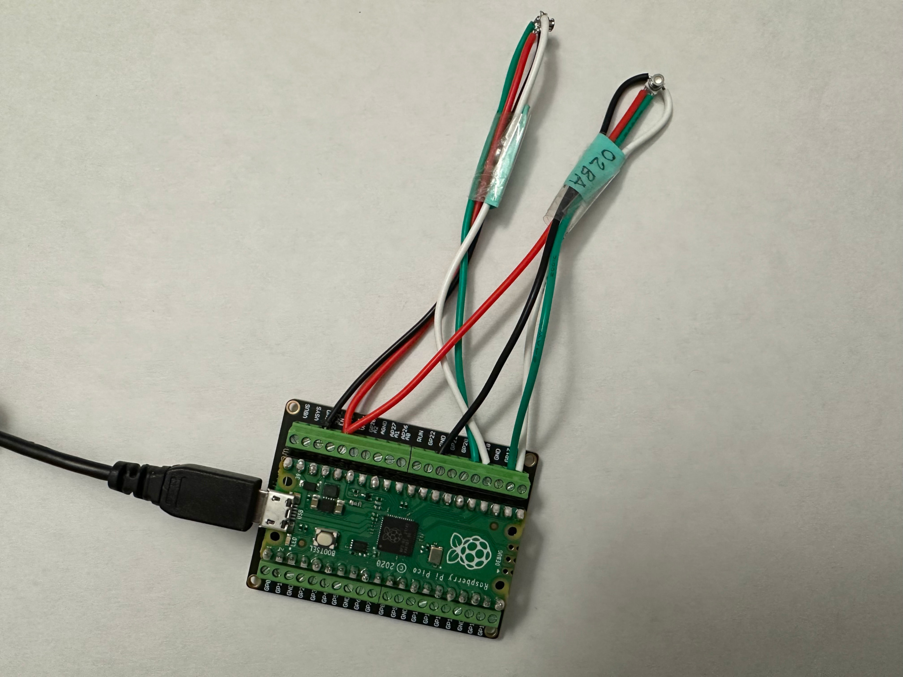

# Micropython Library for Reading MS5837-XXXX Pressure/Water-depth Sensors

This library implements a few micropython classes for reading data out of
popular MS5837 family pressure sensors directly into a micro-controller. These
sensors are commonly found in depth sensors made by BlueRobotics.

## Design Objectives

- API-s for both blocking reads and asynchronous reads with asyncio.
- Configurable oversampling rates, as supported by the sensors.
- Minimal dynamic memory allocation for predictable performance.

## Supported Variants

- MS5837-02BA
- MS5837-30BA

|Data Rate Benchmarking Setup | Depth Sanity Checking with 5 Gallon Water bottle|
|------------------------------------|-------------------------------------------|
| | |

## Example Usage

### Pressure and Temperature Measurement

Reading data in blocking mode -

```python
import time
from machine import I2C
from ms5837.bar30 import MS5837SensorBar30

_SCL_PIN = "GP19"
_SDA_PIN = "GP18"
_OSR_RATE = 4096

# Create I2C object.
i2c_obj = I2C(1, freq=400000, sda=_SDA_PIN, scl=_SCL_PIN)

# Create and initialize sensor object.
sensor = MS5837SensorBar30(
    i2c_obj,
    pressure_osr=_OSR_RATE,
    temperature_osr=_OSR_RATE)

while True:
    pres, temp = sensor.read()
    print(f"P: {pres} KPa, T: {temp} deg-C")
    time.sleep(1.0)
```

### Asynchronously Reading Pressure and Temperature

The `async_read` method can be used to read the sensor data asynchronously.

```python
import asyncio
import time
from machine import I2C
from ms5837.bar30 import MS5837SensorBar30

_SCL_PIN = "GP19"
_SDA_PIN = "GP18"
_OSR_RATE = 4096

# Create I2C object.
i2c_obj = I2C(1, freq=400000, sda=_SDA_PIN, scl=_SCL_PIN)

# Create and initialize sensor object.
sensor = MS5837SensorBar30(
    i2c_obj,
    pressure_osr=_OSR_RATE,
    temperature_osr=_OSR_RATE)

task = sensor.async_read()
while True:
    pres, temp = asyncio.run(task)
    print(f"P: {pres} KPa, T: {temp} deg-C")
    time.sleep(1.0)
```

The above example is silly as only a single async task is running. Ideally, you
should be having other async co-routines to utilize the time idly spend waiting
for the ADC conversion.


### Depth Estimation

The `NaiveDepthEstimator` class can be used with a sensor object to estimate
depth.

```python
import asyncio
import time
from machine import I2C
from ms5837.bar30 import MS5837SensorBar30
from ms5837.depth import NaiveDepthEstimator

_SCL_PIN = "GP19"
_SDA_PIN = "GP18"
_OSR_RATE = 4096
_WATER_DENSITY = 1000

# Create I2C object.
i2c_obj = I2C(1, freq=400000, sda=_SDA_PIN, scl=_SCL_PIN)

# Create and initialize sensor object.
sensor = MS5837SensorBar30(
    i2c_obj,
    pressure_osr=_OSR_RATE,
    temperature_osr=_OSR_RATE)

depth_estimator = NaiveDepthEstimator(sensor, _WATER_DENSITY)
while True:
    depth = depth_estimator.read()
    print("Depth: {:.2f} cm".format(depth / 100.0))
    time.sleep(1.0)
```

`NaiveDepthEstimator` also has an analogous `async_read` method for asynchronous
reading.


## Running the Tests

### Hardware Setup

The tests were designed for an RP2040 micro-controller running micropython. Two
sensors, one MS5837-30BA and another MS5837-02BA were connected to I2C channels
1 and 0 of the micro-controller. The pin configuration is described in the
beginning of `tests/rp2040_tests.py` file.


### Installation

- Install the requirements with `pip install -r requirements.txt`.
- Copy the necessary files to micro-controller by running `./tools/copy_files.sh`.


### Running Tests

Benchmark blocking reads:

```bash
mpremote exec `from rp2040_tests import *; benchmark_blocking_read(SENSOR_BAR30)`
```

Benchmark asynchronous reads:

```bash
mpremote exec `from rp2040_tests import *; benchmark_async_read(SENSOR_BAR02)`
```

Continuously print pressure and temperature data:

```bash
mpremote exec `from rp2040_tests import *; print_data(SENSOR_BAR30)`
```

Continuously print depth data:

```bash
mpremote exec `from rp2040_tests import *; print_data(SENSOR_BAR02)`
```


## Benchmark Results

- Micro-controller: RPi Pico 2040 running at stock speed
- Micropython version: 1.24.1

### Timing of 100 blocking reads for MS5837-02BA

|    OSR |     T_avg[us]|  T_stddev[us]|     T_min[us]|     T_max[us]| Data Rate[Hz]|
|--------|--------------|--------------|--------------|--------------|--------------|
|     256|       2516.93|         26.42|       2498.00|       2762.00|        397.31|
|     512|       3663.57|         21.20|       3644.00|       3851.00|        272.96|
|    1024|       5800.20|         17.28|       5782.00|       5945.00|        172.41|
|    2048|      10100.62|         17.86|      10083.00|      10254.00|         99.00|
|    4096|      18683.49|         17.45|      18666.00|      18832.00|         53.52|
|    8192|      35553.06|         22.05|      35518.00|      35748.00|         28.13|


### Timing of 100 async reads for MS5837-02BA

|    OSR |     T_avg[us]|  T_stddev[us]|     T_min[us]|     T_max[us]| Data Rate[Hz]|
|--------|--------------|--------------|--------------|--------------|--------------|
|     256|       2489.46|         64.99|       2446.00|       3118.00|        401.69|
|     512|       5440.95|        736.74|       4586.00|       7217.00|        183.79|
|    1024|       7672.49|       1134.89|       6919.00|      11362.00|        130.34|
|    2048|      10883.84|       1508.17|       9909.00|      15514.00|         91.88|
|    4096|      18525.77|        597.80|      16941.00|      19479.00|         53.98|
|    8192|      36372.09|        561.14|      34929.00|      37511.00|         27.49|


### Timing of 100 blocking reads for MS5837-30BA

|    OSR |     T_avg[us]|  T_stddev[us]|     T_min[us]|     T_max[us]| Data Rate[Hz]|
|--------|--------------|--------------|--------------|--------------|--------------|
|     256|       2606.48|         25.06|       2589.00|       2840.00|        383.66|
|     512|       3810.43|         18.49|       3792.00|       3969.00|        262.44|
|    1024|       6033.86|         21.00|       6014.00|       6217.00|        165.73|
|    2048|      10554.43|         18.85|      10536.00|      10722.00|         94.75|
|    4096|      19568.32|         23.29|      19546.00|      19784.00|         51.10|


### Timing of 100 async reads for MS5837-30BA

|    OSR |     T_avg[us]|  T_stddev[us]|     T_min[us]|     T_max[us]| Data Rate[Hz]|
|--------|--------------|--------------|--------------|--------------|--------------|
|     256|       2497.80|         64.99|       2464.00|       3122.00|        400.35|
|     512|       5255.70|        718.21|       4727.00|       7278.00|        190.27|
|    1024|       7294.37|        801.82|       6923.00|      10434.00|        137.09|
|    2048|      11769.16|       1945.96|      10531.00|      19380.00|         84.97|
|    4096|      20392.47|        640.80|      18933.00|      21213.00|         49.04|

Note that effective data rate is surprisingly low for async reads with some
non-extreme OSR values. This is caused by read errors and subsequent retries. My
suspicion is on some bugs in the asyncio scheduler or sleep function.


## Things You Might Ask

### Why not directly use the python library provided by BlueRobotics?

The library provided by BlueRobotics is not easily modifiable to use in
micropython environment, as it depends on `python-smbus` library.

### Do we really need to sample depths at high speeds?

Yes. A sensor reading is not the end, rather the beginning of a proper
estimation. High speed sampling allows one to reduce uncertainty estimates using
various mathematical filtering techniques.

### Why is the depth estimation class named `NaiveDepthEstimator`?

Depth estimation with the assumption that water density is constant is a naive
approach in the context of mobile robotics. The class name prefix is a reminder
to that hard truth. The constructor also forces you to specify water density for
the same reason.

For a proper depth estimation, one should do an initial measurement of salinity
in the water-body. For each sensor reading, density should be estimated by
putting salinity and temperature in a model like
[TEOS-10](https://www.teos-10.org/).

A careful look at the variation of gravitational constant `g` due to location of
the experiment might also be necessary.

### Why `enable_sensor_id_check` flag is turned off by default?

Some of the 30BA variant sensors available in the market don't have their sensor
ID properly programmed in the PROM as specified by the data-sheet. I have
encountered this issue in sensors from BlueRobotics and also from raw sensors
from digikey. Other people have
[reported](https://github.com/zephyrproject-rtos/zephyr/issues/60950) the same
thing.


## License

This software is distributed under MIT license. Look at the `LICENSE` file for
the terms of distribution.


## Copyright

2024 Titon Barua <baruat@email.sc.edu, titon@vimmaniac.com>
